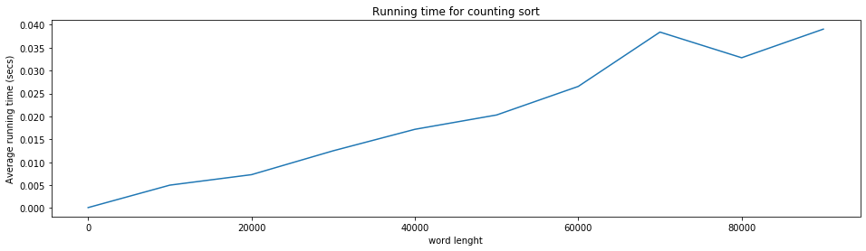
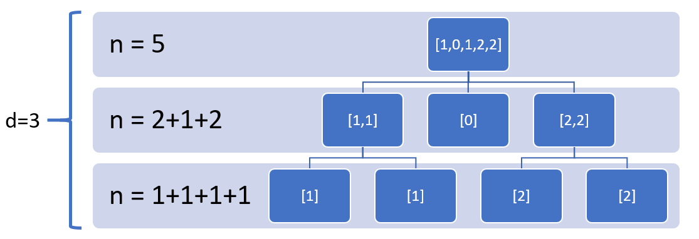
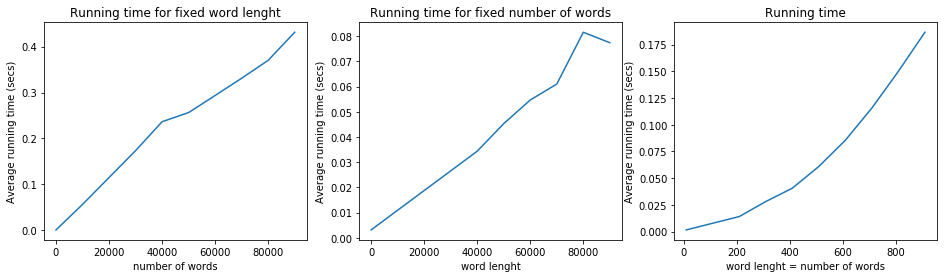

## Alphabetical Sorting
### Counting Sort
Counting sort is a sorting algorithm that sorts the elements of an array by counting the number of occurrences of each unique element in the array. The count is stored in an auxiliary array and the sorting is done by mapping the count as an index of the auxiliary array. And its time complexity is $O(n)$ where n is the size of array. It can be applied only when the values in the array are in a predefined set.
The algorithm used to implement the counting sorted adopted from [here](https://www.youtube.com/watch?v=7zuGmKfUt7s). It computes the frequencies of the values in the array keep them in an auxilary array and relocate the values in the array based on the position that defined by auxilary array described in details on this [page](https://www.programiz.com/dsa/counting-sort). 
### Word Sort
Each word can be converted to list of integers corresponding to the ordinals of its characters. Iterating from the first ordinal of the words to the last one that is the lenght of the longest word, applying counting sort will give the sorted list of words based on the first character, then for those words that have the same character, the counting sort is applied on the second character of the words and this procedure countinoues till the algorithm reaches to the last character or find no duplicated character at some point that is coded as a recursive function.


The numbers inside the boxes in each step in recursive algorithm are those pass as input to counting sort.

### Example
The following example consists of 7 names that selected in a way to consider all the possible different case.


```python
import sorting_lib
words_list = ['Moses', 'Francesco','Sri','Francesca', 'Mosess', 'Alberto', 'Alessio']
sorted_words_list = sorting_lib.alpha_counting_sort(words_list)
print(sorted_words_list)
```

    ['Alberto', 'Alessio', 'Francesca', 'Francesco', 'Moses', 'Mosess', 'Sri']
    

### Empirical and theorical running time of counting sort
The dominant part of the designed algorithm for counting sort includes two for-loop of size n (the size of array) and one of size m (the maximum possible ordinal value) to calculate the the frequencies, array of cumulative values and sorted array. In theory the algorithm suppose to have time complexity of $O(max\{n,m\})$ while m is fixed value it is of the $O(n)$.
The following plot shows that the emperical running time increases linearly respect to the array size as expected.


```python
sorting_lib.plot_time_complexity_count_sort()
```





### Empirical and theorical running time of alphabetical sort
In each iteration of recursive function that sorts the words, if at least one character is duplicated a new subproblem will be generated and recursive function calls itself. In the first step a problem of size n (number words to be sorted) have to be solved by recursive function and check wheather there exists at least one duplicated character to generate subpromlems. The following picture shows how the recursive function works. d is the maximum length of the words. So in the worst case where all words are the same, the summation of the size of subproblems is n, so the theorical running time is $O(nd)$.     



To analyze the empirical running time, we fixed words length and number of words respectively from left to right (for fixed $d$ and $n$) that yeilds to two linear plots. To test the running time with respect to $n$ and $d$ at the same time ($n = d$), we set them to be equal that its result is shown on the right most plot that follows a quaderatic line that demonstrate the time complexity of $O(nd)$ 


```python
sorting_lib.plot_time_complexity_alpha_sort()
```




